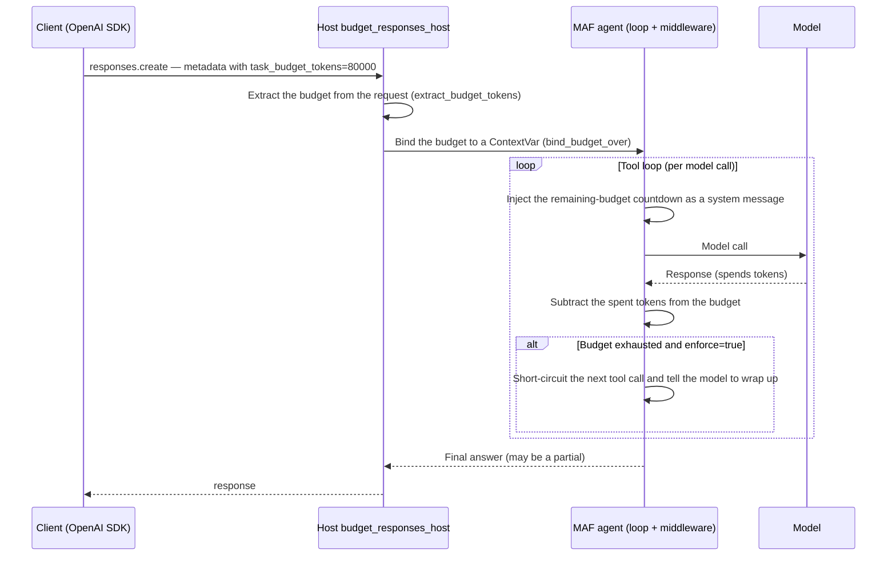
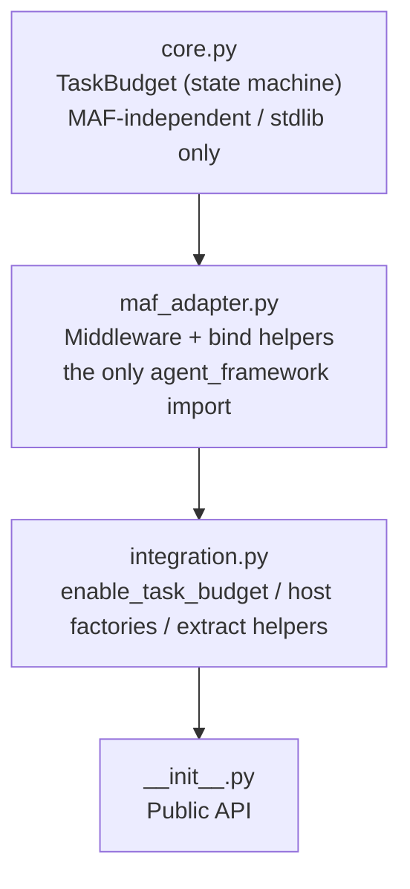

# agent-framework-task-budget — Specification

A minimal extension that gives a **task budget** to Microsoft Agent Framework (MAF) agents.

> This is a supplementary document. For installation and a quickstart, see [../README.md](../README.md).

---

## 1. What it is (in 30 seconds)

When an agent runs a loop that calls tools many times, this extension caps the **total number of tokens the whole task may spend** and keeps the agent aware of that limit.

It does exactly three things:

1. **Advisory countdown** — before *each* model call, show the remaining token budget as a system message.
2. **Token accounting** — after each call, subtract the tokens it spent (thinking + tool calls + tool results + output) from the budget.
3. **Enforcement backstop (optional)** — once the budget is spent, stop the agent from calling more tools and tell it to write a final answer from what it already has.

The key idea is that it is **advisory by default (not a hard stop)**: the model is told how much budget remains so it can pace itself and wrap up early. Enforcement is only a safety net that, when the budget is exceeded, keeps the model from continuing and makes it summarize with what it already gathered.

---

## 2. Design philosophy: advisory first

- The budget is **purely advisory** by default. Instead of hard-stopping the loop, it tells the model how much remains so it wraps up before hitting the limit.
- Enforcement is an optional, per-request **backstop**, not the primary mechanism. When it fires, it stops **between tool turns** and keeps the text the model has already produced — it never truncates a reply to an empty answer.
- The result of enforcement is therefore a **graceful partial**: a final answer built from the information already gathered.

---

## 3. Big picture (server side and client side)

The intended scenario is a MAF agent deployed as a **Foundry hosted agent**. The agent's loop — and therefore this extension's middleware — runs **server-side**. A remote client simply adds **one budget value** to the request it already sends, and imports nothing from this library.



**Why the host wrapper (`budget_responses_host`) is needed**: the stock Responses host drops the request's `metadata` / `extra_body` before running the agent, so a budget field would never reach the agent. `budget_responses_host` lifts the budget out of `request.metadata` and binds it across the server-side run.

---

## 4. Architecture (layering)

A ports-and-adapters design in three layers. All coupling to MAF is confined to **one file, `maf_adapter.py`**.



| Module | Role | Depends on agent_framework |
|---|---|---|
| `core.py` | The budget state machine `TaskBudget` (consume, remaining, countdown text, exhaustion) | No |
| `maf_adapter.py` | MAF middleware (advisory / enforcement) and budget binding (`bind_budget` / `bind_budget_over`) | Yes (the only one) |
| `integration.py` | Server wiring `enable_task_budget`, host factories, request extraction | Indirectly (via the adapter) |
| `__init__.py` | Re-exports the public symbols | Optional (exposes only core if MAF is absent) |

The benefit: a MAF version bump can only ever affect `maf_adapter.py`, and `core.TaskBudget` is always importable and unit-testable even without `agent_framework` installed.

---

## 5. Installation

Install straight from GitHub (no manual clone needed):

```pwsh
pip install git+https://github.com/hatasaki/agent-framework-task-budget.git
```

- Distribution name: `agent-framework-task-budget`
- Import name: `agent_framework_task_budget`
- The `agent-framework` (>= 1.10) dependency is installed automatically. In an environment that already has MAF, only the extension is added (pip does not re-fetch an already-satisfied dependency).

---

## 6. Usage

### 6.1 Server side (add two lines to an existing MAF agent)

```python
from agent_framework_task_budget import enable_task_budget, budget_responses_host

agent = FoundryChatClient(model="gpt-4o").as_agent(instructions="...")  # your existing agent

enable_task_budget(agent)              # <- add: wire the countdown + token accounting
app = budget_responses_host(agent)     # <- add: host it as a budget-aware Responses server
```

- `enable_task_budget(agent)` wires the budget-*reading* middleware (advisory + enforcement backstop) once.
- `budget_responses_host(agent)` builds a host that lifts the budget out of `request.metadata` and binds it to the run. Pass `default_total=` for a server-side fallback when a request omits the budget.

> For the Invocations protocol, use `budget_invocations_host(agent)` (the client sends a plain JSON body instead of using the OpenAI SDK).

### 6.2 Client side (OpenAI SDK; imports nothing from this library)

```python
from openai import OpenAI

client = OpenAI(base_url="https://<your-hosted-agent-endpoint>", api_key="...")

client.responses.create(
    model="my-agent",
    input="Investigate the flaky CI test.",
    metadata={"task_budget_tokens": "80000"},   # advisory only
)
```

Add the flag to the same `metadata` only on requests where you want the enforcement backstop:

```python
client.responses.create(
    model="my-agent",
    input="Investigate the flaky CI test.",
    metadata={
        "task_budget_tokens": "80000",
        "task_budget_enforce": "true",   # omit / "false" = advisory only
    },
)
```

The same `metadata` also governs `stream=True` calls — accounting and enforcement still apply; the only change to the request is adding `stream=True`.

---

## 7. Request field reference

Client fields are **plain strings/integers**. Responses API `metadata` values are always **strings** by spec, so send numbers as digit strings (e.g. `"80000"`). The server looks at the top level as well as inside `metadata` / `extra_body`.

| Field | Type | Meaning | Default |
|---|---|---|---|
| `task_budget_tokens` | int or digit string | The total token budget for this request. **Its presence activates the budget.** | none (absent = no budget = normal behavior) |
| `task_budget_enforce` | bool or `"true"`/`"1"`/`"yes"`/`"on"` | Turn on the enforcement backstop | `false` (advisory only) |
| `task_budget` (alias) | int or digit string | Alias for `..._tokens`; either works | — |

Notes:

- Only a positive integer is a valid budget (`0`, negatives, and `bool` are ignored and treated as "no budget").
- The constant name `task_budget_remaining` is reserved, but **the current host factories read only `tokens` and `enforce`** (resuming a partially-spent budget is not wired on the hosted path). To persist and resume a budget, use `TaskBudget.snapshot()` / `TaskBudget.restore()` (see [§10](#10-the-taskbudget-state-machine-core)).

---

## 8. Public API reference

Main symbols exported from `agent_framework_task_budget`.

### Server wiring & hosting

| Symbol | Kind | Description |
|---|---|---|
| `enable_task_budget(agent)` | function | Wire the budget-reading middleware (advisory + enforcement) onto an agent once. Returns the same agent (chainable). |
| `budget_responses_host(agent, *, default_total=None, **kwargs)` | function | Build a budget-aware host for the Responses protocol; extracts the budget from `request.metadata` and binds it to the run. |
| `budget_invocations_host(agent, *, default_total=None, **kwargs)` | function | Build a budget-aware host for the Invocations protocol; extracts the budget from the JSON body. Handles both non-streaming and streaming. |

### Middleware (normally used via `enable_task_budget`)

| Symbol | Kind | Description |
|---|---|---|
| `TaskBudgetChatMiddleware(budget=None)` | ChatMiddleware | Injects the countdown before each model call and accounts spent tokens. The budget is either fixed (constructor) or bound at run time. |
| `TaskBudgetEnforcementMiddleware(budget=None, *, message=...)` | FunctionMiddleware | The enforcement backstop: when the budget is spent it does not run the tool and returns a "wrap up now" instruction as the result. |

### Budget binding (used inside the host factories)

| Symbol | Kind | Description |
|---|---|---|
| `bind_budget(total, *, min_total=0, enforce=False)` | context manager | Bind a budget to a ContextVar for the duration of a single `await agent.run(...)` (non-streaming / Invocations). `total=None` is a no-op. |
| `bind_budget_over(events, total, *, min_total=0, enforce=False)` | async generator | Bind a budget only while an event stream is iterated (Responses host / streaming). |

### Server-side helpers & constants

| Symbol | Kind | Description |
|---|---|---|
| `extract_budget_tokens(payload, *, keys=..., containers=...)` | function | Pull a positive token budget out of a request body (`None` if absent). |
| `extract_budget_enforce(payload, *, containers=...)` | function | Pull the enforcement flag (default `False`). |
| `TaskBudget` | dataclass | The budget state machine (see [§10](#10-the-taskbudget-state-machine-core)). MAF-independent, always importable. |
| `BUDGET_TOKENS_KEY` / `BUDGET_ENFORCE_KEY` / `BUDGET_REMAINING_KEY` | constants | Request field names (`task_budget_tokens` / `_enforce` / `_remaining`). |

---

## 9. What happens when you set a budget (verified live)

Behavior confirmed against `gpt-5.4-mini` on Foundry, **comparing the same agent with and without a budget**. The outcome depends on the budget size, the shape of the task, and whether enforcement is on.

### Pattern 1 — advisory only, on a real tool loop: the model paces itself

```python
metadata={"task_budget_tokens": "3582"}
```

The countdown is a **hint, not a limit** (the loop is never force-stopped). But on a genuine multi-step tool loop (here: a 12-city itinerary walked one tool call at a time), showing the remaining budget before each call makes the model **stop early and wrap up**. Measured on the same task with the budget at ~40% of the natural cost:

| | advisory OFF | advisory ON |
|---|---|---|
| Did the loop stop? | no (ran to completion) | no (the model *chose* to stop) |
| Tool iterations | 12 | 6 |
| Total tokens | 8,955 | 5,216 |
| Final answer | all 12 cities | first 6 cities + wrap-up |

> **Caveat — short tasks.** On a task that is already just one or two tool calls there is nothing to pace: the countdown text is extra input the model pays for, so total tokens can go slightly *up*. The benefit shows up on genuine multi-step loops.

### Pattern 2 — enforcement on, budget runs out: a partial, not an empty answer

```python
metadata={"task_budget_tokens": "3582", "task_budget_enforce": "true"}
```

`enforce` layers a backstop **on top of** the advisory (the countdown is still injected). When the budget is spent, the next tool call is **short-circuited**: instead of running the tool, the model receives a *"budget spent — stop calling tools and write your best final answer from what you have"* result. The model then writes a **partial**, not an empty response.

Verified on the 12-city loop with the budget at ~40% (runs out after 5 cities):

- gathered Tokyo, Paris, New York, London, Sydney,
- the 6th tool call was short-circuited by the backstop,
- finished with a ~337-character recap of the five, noting that the full itinerary could not be completed because the budget was spent.

The backstop stops **between turns** and keeps already-generated text; it never truncates a reply to empty. Advisory-only at the same budget wraps up similarly on its own, but `enforce` **guarantees** the loop stops.

### Pattern 3 — enforcement on but the task fits: it just completes

```python
metadata={"task_budget_tokens": "200000", "task_budget_enforce": "true"}
```

When the work fits the budget, `enforce` behaves exactly like advisory mode with a backstop that never fires. Observed: both tools ran, the countdown was injected on every call, the budget went `200,000 → 199,300`, and the run finished normally with a concise answer.

---

## 10. The TaskBudget state machine (core)

`TaskBudget` is a pure, MAF-independent state machine (`from agent_framework_task_budget import TaskBudget`).

```python
@dataclass
class TaskBudget:
    total: int                     # total token budget for the whole task
    remaining: int | None = None   # remaining tokens (defaults to total)
    min_total: int = 20_000        # sanity floor on total (set 0 to disable)
```

| Member | Description |
|---|---|
| `consume(tokens)` | Subtract the tokens spent by one model call from `remaining` (never goes below 0). |
| `exhausted` (property) | `True` once `remaining` reaches 0. |
| `fraction_left` (property) | `remaining / total`, in `[0.0, 1.0]`. |
| `render_status()` | Produce the countdown text shown to the model before each model call (see below). |
| `snapshot()` | A `{"total", "remaining"}` dict, for persisting across sessions/compaction. |
| `restore(data, *, min_total=20_000)` | Rebuild a budget from `snapshot()` (useful to resume a partially-spent budget). |

---

## 11. Design points and constraints

- **Hosted (remote) only.** Only the hosted-agent path is supported. There is no "in-process" path that passes a budget directly to `agent.run(...)` in the same process.
- **Enforcement is per-request opt-in.** The default is advisory-only. The server does not decide enforcement globally; the client opts in per request via `task_budget_enforce`.
- **Activation condition.** If a request carries no valid `..._tokens` (a positive integer), that run is a complete no-op (normal behavior).
- **Concurrency isolation.** The budget is bound to a `ContextVar`, so a shared agent stays isolated per run.
- **MAF version resilience.** Touch-points such as `usage_details`, `Message`, `call_next`, and `ChatContext` are accessed defensively, so future renames/shape changes are unlikely to break it fatally (all coupling lives in `maf_adapter.py`).
- **Observability.** One INFO log line is emitted per budgeted run (logger `agent_framework_task_budget`; no handler is attached, so it appears only if the host enables INFO).
- **Where token counts come from.** Each call's spend is read from `ChatResponse.usage_details` (`total_token_count`, or `input + output` if absent). If the provider omits usage, it is treated as 0.

---

## 12. Compatibility

- **Verified MAF version:** `agent-framework` v1.10
- **Python:** 3.10+

---

## Appendix: Glossary

| Term | Meaning |
|---|---|
| advisory | The mode that only tells the model the remaining budget; never force-stops the loop. Default. |
| enforce | The backstop that stops the next tool call when the budget is spent and makes the model wrap up. Opt-in per request. |
| graceful partial | A final answer built from what was already gathered, rather than truncating to empty. |
| countdown | The "X of Y tokens left" system message injected before each model call. |
